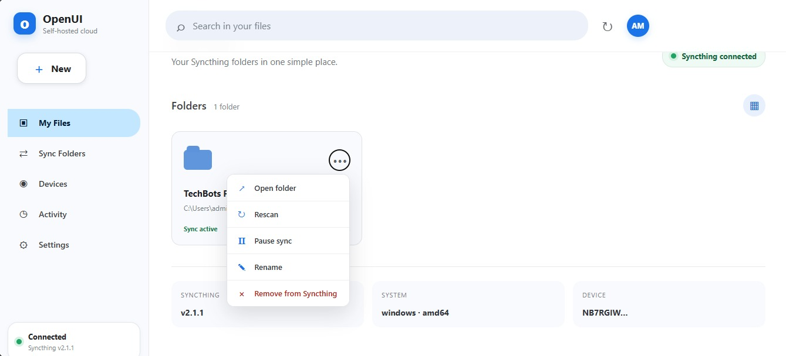
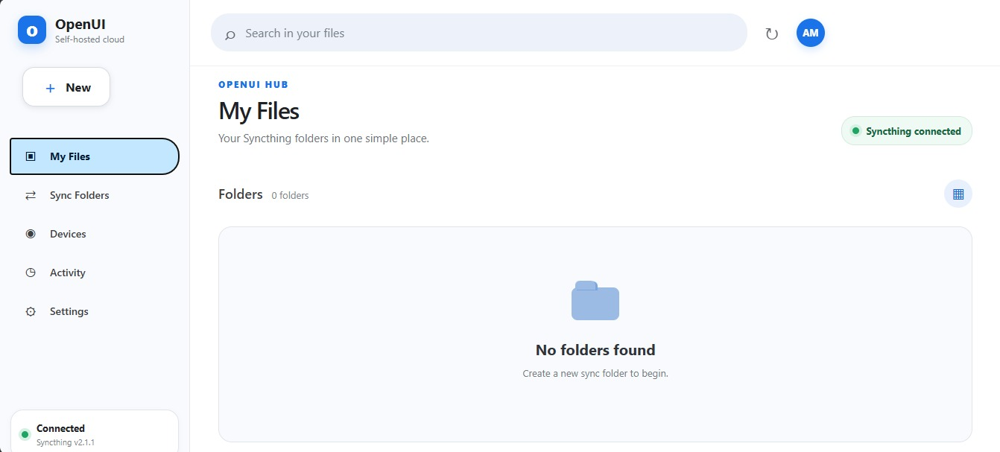
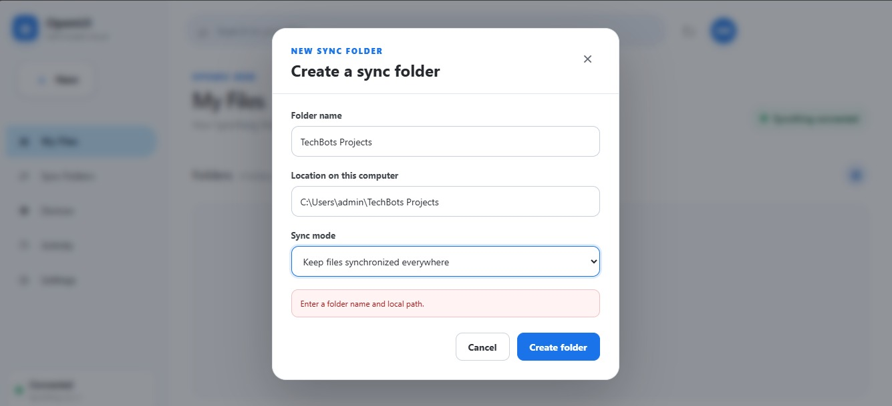
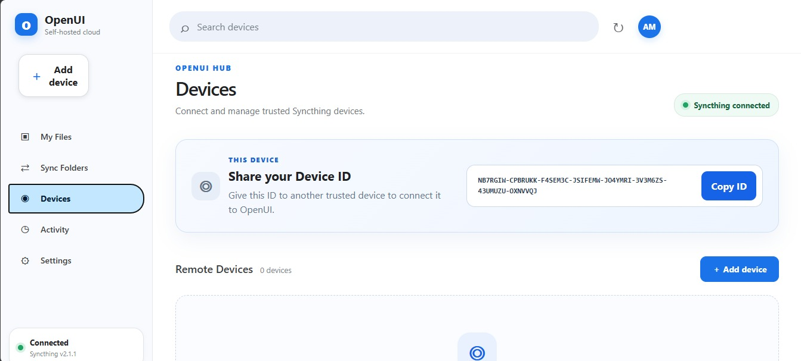
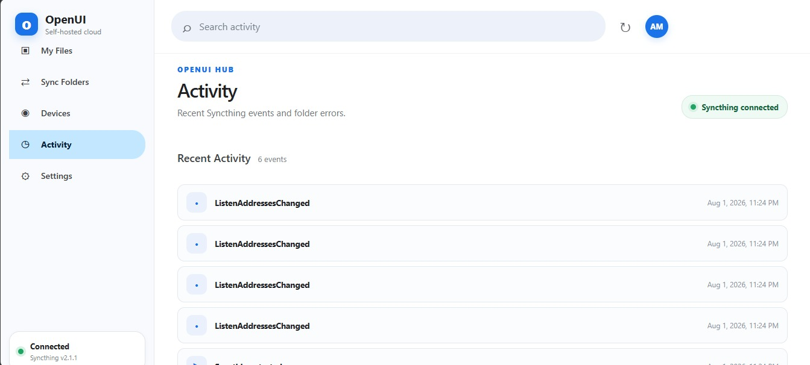
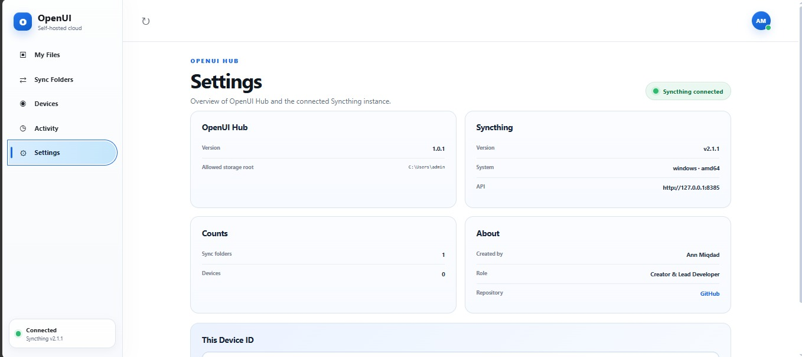

<div align="center">

# OpenUI Hub

### Self-hosted applications, simplified through one clean Windows interface.

[](https://github.com/Ann-herself/openui-hub/releases)
[](https://github.com/Ann-herself/openui-hub/releases)
[](backend)
[](frontend)
[](LICENSE)

**Designed and developed by [Ann Miqdad](https://github.com/Ann-herself)**

[Windows Releases](https://github.com/Ann-herself/openui-hub/releases) ·
[Report an Issue](https://github.com/Ann-herself/openui-hub/issues) ·
[Suggest an Improvement](https://github.com/Ann-herself/openui-hub/issues/new)

</div>

---

## Overview

**OpenUI Hub** is an open-source Windows application designed to make self-hosted software easier to use.

The current implementation provides a unified and user-friendly interface for managing **Syncthing** files, folders, devices, synchronization activity, and application settings.

Instead of requiring users to work directly with technical configuration pages, command-line tools, or multiple disconnected services, OpenUI Hub brings essential functionality into one clean dashboard.

The distributed Windows package combines:

- A React and TypeScript frontend
- A FastAPI backend
- A dedicated Windows launcher
- An isolated Syncthing runtime
- Windows packaging and installation workflows

End users do not need to install Python, Node.js, or development tools to use the packaged application.

---

## The Vision

OpenUI Hub is intended to grow beyond a single Syncthing interface.

The long-term goal is to create a unified hub where users can install, access, configure, and manage multiple self-hosted and open-source applications through simple, consistent interfaces.

Each integration should:

- Reduce technical setup complexity
- Replace fragmented dashboards with a consistent experience
- Make open-source tools more approachable for non-technical users
- Keep services local, private, and user-controlled
- Provide clear status, activity, and configuration information
- Support modular expansion without redesigning the complete application

Syncthing is the first supported integration and serves as the foundation for the wider OpenUI Hub concept.

---

## Project Status

OpenUI Hub is currently a **functional open-source prototype and actively maintained Windows application**.

Core workflows for file management, synchronization folders, remote devices, activity monitoring, and application information have been implemented.

The project is still being refined. Further interface improvements, testing, packaging enhancements, and additional self-hosted integrations remain part of the roadmap.

Feedback is welcome at this stage. Comments, issue reports, usability observations, code review, and suggestions for technical or interface improvements are highly appreciated.

---

## Features

### File Management

- Browse Syncthing folders and their contents
- Navigate through nested folders
- Upload and download files
- Create new folders
- Rename files and folders
- Permanently delete files and folders
- Preview supported file types
- Protect against invalid paths and directory traversal

### Synchronization Folders

- View configured Syncthing folders
- Create new synchronization folders
- Pause and resume folders
- Rename synchronization folders
- Trigger immediate scans
- Open local folder locations
- Remove configured folders
- Display folder type and connected device count

### Device Management

- View configured remote Syncthing devices
- Display connection status
- Add new remote devices
- Edit device names and addresses
- Pause and resume devices
- Remove devices
- Copy the local Syncthing Device ID

### Activity and System Information

- Review recent synchronization activity
- Display recent Syncthing events
- Review folder-related errors
- View application version information
- View Syncthing version and runtime information
- Display storage and configuration details
- Refresh application data from the interface

### Windows Experience

- Standard Windows installer
- Portable Windows package
- Dedicated desktop launcher
- Automatic local backend startup
- Automatic Syncthing runtime management
- Local application data directory
- Browser-based interface bound to the local computer

---

## Screenshots

### Dashboard

<p align="center">
  
</p>

<table>
  <tr>
    <td width="50%" valign="top">
      <strong>File Management</strong>
      <br><br>
      
    </td>
    <td width="50%" valign="top">
      <strong>Sync Folder Management</strong>
      <br><br>
      
    </td>
  </tr>
  <tr>
    <td width="50%" valign="top">
      <strong>Device Management</strong>
      <br><br>
      
    </td>
    <td width="50%" valign="top">
      <strong>Activity Monitoring</strong>
      <br><br>
      
    </td>
  </tr>
</table>

### Application Settings

<p align="center">
  
</p>

---

## Download and Install

### Windows Installer — Recommended

1. Open the [OpenUI Hub Releases](https://github.com/Ann-herself/openui-hub/releases) page.
2. Open the latest published Windows release.
3. Download:

```text
OpenUI-Hub-Setup-v1.0.3.exe
```

4. Close any previous OpenUI Hub or bundled Syncthing process.
5. Run the installer.
6. Launch **OpenUI Hub** from the Windows Start Menu.

### Portable Package

1. Download:

```text
OpenUI-Hub-Portable-v1.0.3.zip
```

2. Extract the ZIP archive.
3. Open the extracted directory.
4. Run:

```text
OpenUIHub\OpenUIHub.exe
```

The portable package can be used without completing the standard Windows installation process.

> Release assets may be published or updated separately from the source code.  
> Check the Releases page for the latest tested package.

---

## System Requirements

- Windows 10 or Windows 11
- 64-bit operating system
- Permission to run desktop applications
- Network access when connecting additional Syncthing devices
- Available local storage for synchronized folders

The packaged version does not require a separate installation of Python, Node.js, npm, or Syncthing.

---

## How It Works

OpenUI Hub starts a local FastAPI service and opens the interface in the default web browser.

The default local address is:

```text
http://127.0.0.1:8765
```

The interface is bound to the local computer and is not exposed publicly by default.

Runtime configuration, application logs, and the isolated Syncthing home directory are stored under:

```text
%LOCALAPPDATA%\OpenUIHub
```

Typical directories include:

```text
%LOCALAPPDATA%\OpenUIHub\config
%LOCALAPPDATA%\OpenUIHub\logs
%LOCALAPPDATA%\OpenUIHub\syncthing
```

Synchronized files remain inside folders selected or configured by the user.

---

## Technology Stack

| Layer | Technology |
|---|---|
| Frontend | React, TypeScript, Vite |
| Backend | Python, FastAPI, Uvicorn |
| Synchronization | Syncthing |
| Desktop launcher | Python |
| Windows packaging | PyInstaller |
| Installer | Inno Setup |
| Local interface | Browser-based UI managed by the Windows launcher |
| Automation | PowerShell and GitHub Actions |

---

## Project Architecture

```text
┌─────────────────────────────────────────────┐
│               OpenUI Hub UI                 │
│        React + TypeScript + Vite            │
└─────────────────────┬───────────────────────┘
                      │ Local REST API
┌─────────────────────▼───────────────────────┐
│              FastAPI Backend                │
│  Files, folders, devices, activity, config  │
└─────────────────────┬───────────────────────┘
                      │ Syncthing REST API
┌─────────────────────▼───────────────────────┐
│             Syncthing Runtime               │
│      Synchronization and device layer       │
└─────────────────────────────────────────────┘
```

The Windows launcher manages the local application lifecycle, selects available ports, starts the required runtime components, and opens the user interface.

---

## Project Structure

```text
openui-hub/
├── .github/
│   └── workflows/          # Continuous integration workflows
├── backend/
│   ├── main.py             # FastAPI application and API routes
│   ├── requirements.txt    # Python dependencies
│   └── version.py          # Application version
├── desktop/
│   └── launcher.py         # Windows application launcher
├── docs/
│   └── images/             # Product screenshots
├── frontend/
│   ├── src/                # React and TypeScript source
│   ├── public/             # Static frontend assets
│   └── package.json        # Frontend dependencies and scripts
├── installer/              # Inno Setup configuration
├── licenses/               # Third-party license texts
├── scripts/                # Build, verification, and release scripts
├── vendor/                 # Local build-time third-party runtime files
├── AUTHORS.md
├── LICENSE
├── README.md
├── RELEASE_NOTES_v1.0.3.md
└── THIRD_PARTY_NOTICES.txt
```

---

## Development Setup

### Requirements

Install the following development tools:

- Python 3.11 or newer
- Node.js 20 or newer
- npm
- Git
- Syncthing

### Clone the Repository

```powershell
git clone https://github.com/Ann-herself/openui-hub.git
cd openui-hub
```

### Create the Backend Environment

```powershell
python -m venv backend\.venv
.\backend\.venv\Scripts\Activate.ps1
pip install -r backend\requirements.txt
```

Create a local development file at:

```text
backend\.env
```

Example:

```env
SYNCTHING_URL=http://127.0.0.1:8384
SYNCTHING_API_KEY=replace-with-your-local-api-key
OPENUI_ALLOWED_ROOT=C:\Users\YourName
```

Never commit `.env` files, passwords, Syncthing API keys, user configuration, or local runtime data.

### Install the Frontend Dependencies

```powershell
cd frontend
npm ci
cd ..
```

### Build the Frontend

```powershell
cd frontend
npm run build
cd ..
```

### Run from Source

```powershell
.\backend\.venv\Scripts\python.exe .\desktop\launcher.py
```

The launcher starts the required local services and opens the application in the default browser.

---

## Validate the Source

Run the project validation script before creating a release:

```powershell
Set-ExecutionPolicy -Scope Process -ExecutionPolicy Bypass -Force
.\scripts\verify-source.ps1
```

The validation workflow checks the Python source, frontend build, and key project files.

GitHub Actions also runs repository validation when changes are pushed or submitted through a pull request.

---

## Build the Windows Release

Place the Windows Syncthing executable at:

```text
vendor\syncthing\syncthing.exe
```

Then run:

```powershell
Set-ExecutionPolicy -Scope Process -ExecutionPolicy Bypass -Force

.\scripts\build-windows.ps1 -Version 1.0.3
.\scripts\build-installer.ps1 -Version 1.0.3
```

Expected release assets:

```text
release-dist\OpenUI-Hub-Setup-v1.0.3.exe
release-dist\OpenUI-Hub-Portable-v1.0.3.zip
release-dist\SHA256SUMS.txt
```

The generated release directory should not be committed to the source repository. Final binaries should be distributed through GitHub Releases.

---

## Verify Release Files

Users can verify downloaded release files using the SHA-256 values included in:

```text
SHA256SUMS.txt
```

Example PowerShell command:

```powershell
Get-FileHash `
  ".\OpenUI-Hub-Setup-v1.0.3.exe" `
  -Algorithm SHA256
```

Compare the generated value with the corresponding value inside `SHA256SUMS.txt`.

---

## Security and Privacy

- OpenUI Hub binds its application interface to `127.0.0.1`.
- Application data remains on the user's local computer.
- Syncthing credentials and runtime settings are stored locally.
- Secrets and `.env` files are excluded from the repository.
- File operations are restricted to configured synchronization folders.
- Directory traversal attempts are rejected.
- Reserved Syncthing system entries are protected.
- Invalid Windows filenames and unsafe paths are rejected.
- The application does not intentionally send user files to an external OpenUI Hub server.

Do not include security-sensitive information, private paths, credentials, or API keys in a public GitHub issue.

For sensitive security reports, contact the project maintainer privately.

---

## Roadmap

The planned direction for OpenUI Hub includes:

- Continue improving the Windows user experience
- Refine Activity and Settings functionality
- Improve installation and update handling
- Add clearer diagnostics and recovery tools
- Add automated release testing
- Improve responsive and mobile-friendly access
- Add modular support for additional self-hosted applications
- Create a shared interface system for future integrations
- Add application discovery and installation workflows
- Build a unified dashboard for multiple local services
- Support additional operating systems in future versions
- Expand community documentation and contribution guides

Potential future integrations may include file services, media platforms, monitoring tools, communication systems, development tools, and other open-source self-hosted applications.

The final objective is not only to manage Syncthing, but to make a wider range of self-hosted applications easier to understand and use.

---

## Feedback and Contributions

OpenUI Hub is open to feedback, testing, review, and collaboration.

I am especially interested in receiving comments about:

- User-interface clarity
- Installation experience
- Windows compatibility
- Syncthing integration
- File and folder workflows
- Device management
- Error handling
- Security considerations
- Code structure and maintainability
- Ideas for future application integrations

Suggestions and constructive criticism are welcome.

You can participate by:

- Opening a [bug report](https://github.com/Ann-herself/openui-hub/issues)
- Suggesting a new feature
- Reporting unclear behavior
- Reviewing the code
- Proposing documentation improvements
- Submitting a pull request

All thoughtful comments and proposed improvements will be reviewed as the project continues to grow.

---

## A Personal Note

OpenUI Hub is also a personal return to hands-on software development.

After spending a period away from building and publishing software projects, I wanted to return with an idea that could grow beyond a small demonstration. I chose to build a project that combines practical engineering, open-source technology, interface design, local application management, and long-term extensibility.

This first release is not intended to represent the end of the project. It represents a new starting point.

Syncthing is the first integration, but the wider goal is to develop OpenUI Hub into a platform that can bring multiple self-hosted applications together through interfaces that are clearer, easier, and more consistent.

I welcome comments, corrections, technical review, and suggestions. The project will continue to be improved based on testing, learning, and community feedback.

— **Ann Miqdad**

---

## AI-Assisted Development

AI tools were used as development assistants for debugging, code review, documentation, and implementation refinement.

The project concept, architecture, product direction, feature decisions, Syncthing integration, testing, review, maintenance, and final ownership remain with **Ann Miqdad**.

All AI-assisted changes were reviewed, understood, adapted, and maintained before being included in the project.

---

## Third-Party Software

OpenUI Hub integrates with third-party open-source software.

Syncthing is licensed separately under the Mozilla Public License 2.0.

See:

- [`THIRD_PARTY_NOTICES.txt`](THIRD_PARTY_NOTICES.txt)
- [`licenses/`](licenses/)

All third-party software remains the property of its respective authors and contributors.

---

## Author

**Ann Miqdad**  
Original creator and lead developer of OpenUI Hub.

- GitHub: [@Ann-herself](https://github.com/Ann-herself)
- Repository: [Ann-herself/openui-hub](https://github.com/Ann-herself/openui-hub)
- Issues and feedback: [OpenUI Hub Issues](https://github.com/Ann-herself/openui-hub/issues)

---

## License

OpenUI Hub is available under the [MIT License](LICENSE).

```text
Copyright (c) 2026 Ann Miqdad
```

---

<div align="center">

### OpenUI Hub

**Making self-hosted software easier, one integration at a time.**

Created and maintained by **Ann Miqdad**

</div>
